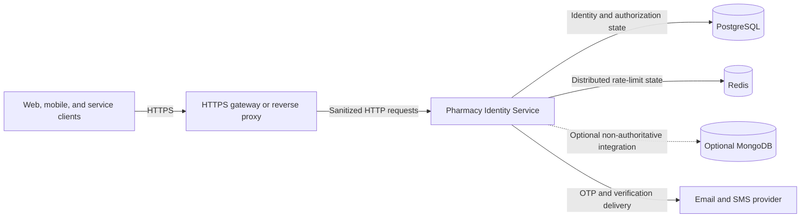
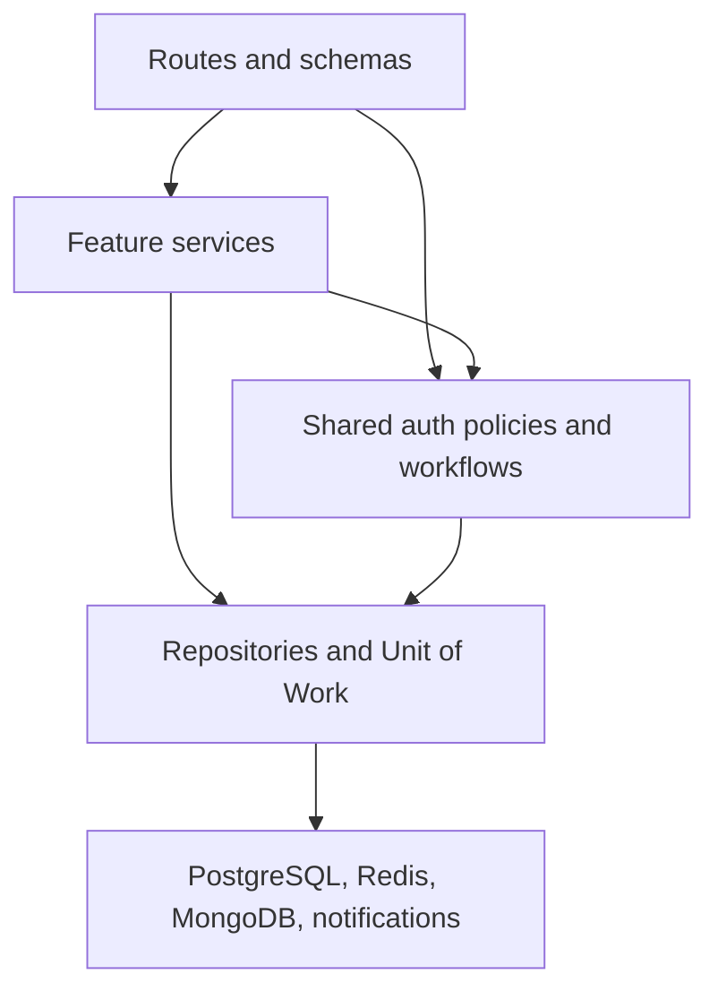

# Pharmacy Identity Service Architecture

## Purpose

Pharmacy Identity Service is the healthcare platform’s authentication and authorization boundary. It converts verified credentials into short-lived access tokens, manages persisted sessions and refresh-token rotation, and resolves current roles and permissions from PostgreSQL.

This document describes structure, responsibilities, trust boundaries, and design decisions. Endpoint contracts belong in [`docs/API.md`](docs/API.md), deployment procedures in [`docs/DEPLOYMENT.md`](docs/DEPLOYMENT.md), and runtime values in [`.env.example`](.env.example).

## Design principles

- PostgreSQL is authoritative for users, credentials, sessions, roles, and permissions.
- Access tokens prove authentication; they do not carry mutable authorization state.
- Refresh tokens are rotated, stored only as digests, and protected against replay.
- Public registration cannot select privileged roles.
- Feature modules own their HTTP, validation, service, and repository behavior.
- Infrastructure clients are process-scoped and created once during application lifespan.
- Database schema evolution is external and owned by `healthcare_db`.
- Production security controls fail closed when required infrastructure is unavailable.

## System context



The edge controls public exposure and TLS. The API validates application-level authentication and authorization. PostgreSQL remains the system of record even when optional integrations are enabled.

## Application composition

`app.main.create_app()` builds the FastAPI application from validated settings. It configures logging, lifecycle management, middleware, exception handlers, health routes, and the versioned module router.

```text
app/
├── api/
│   ├── health.py               # Liveness, readiness, deep diagnostics
│   ├── exception_handlers.py   # Client-safe error translation
│   └── v1/router.py            # Version-one route composition
├── auth/
│   ├── authorization/          # Principals, claims, roles, permissions
│   ├── identity/               # Canonical identity normalization
│   ├── infrastructure/         # Runtime composition and OpenAPI helpers
│   ├── request_context/        # Request, client, device, and trace context
│   ├── security/               # Hashing, passwords, JWTs
│   └── workflows/              # OTP, sessions, notifications, limits
├── core/                       # Settings, middleware, logging, lifecycle
├── db/                         # PostgreSQL, Redis, MongoDB, Unit of Work
├── models/                     # Runtime SQLAlchemy mappings
└── modules/                    # Vertical business capabilities
```

## Vertical modules

The service is organized by capability rather than by a single global controller/service/repository layer.

| Module group | Responsibility |
| --- | --- |
| Registration | Email/password and phone/OTP account creation |
| Login | Password and OTP authentication |
| Token management | Refresh rotation and logout operations |
| Session management | Session discovery and revocation |
| Password management | Change, initial setup, recovery, and reset |
| Email verification | Verification challenge lifecycle |
| Current user | Profile and current authorization projection |
| Capabilities | Public authentication-policy discovery |
| Administration | Users, roles, permissions, and assignments |

A module normally contains:

```text
routes.py        HTTP transport and declarative security
schemas.py       Request and response validation
service.py       Use-case orchestration and business rules
repositories.py  Persistence operations
dependencies.py  Request-scoped construction
openapi.py       Module-specific API documentation metadata
```

Routes do not contain persistence logic. Repositories do not make authorization decisions. Services coordinate business rules inside explicit transaction boundaries.

## Dependency direction



Dependencies point inward toward business rules and stable interfaces. Infrastructure is accessed through lifecycle-owned adapters; request code must not create independent pools or clients.

## Process lifecycle

FastAPI’s lifespan owns process-wide resources:

1. Validate environment-backed settings.
2. Create the asynchronous PostgreSQL engine and pool.
3. Optionally verify PostgreSQL connectivity and required schemas.
4. Create Redis when explicitly enabled or required by rate limiting.
5. Create MongoDB only when explicitly enabled.
6. Build the shared rate limiter and authentication runtime.
7. Publish initialized resources through `app.state`.
8. Close resources in reverse order during shutdown.

PostgreSQL can start in a configured degraded mode. Enabled Redis and MongoDB integrations fail startup when they cannot initialize. Production rate limiting requires Redis and must not silently fall back to process memory.

## Request lifecycle

Starlette applies the last registered middleware as the outermost wrapper. The effective request flow is:

```text
Request
  -> request/correlation context
  -> structured request logging and timing
  -> security response headers
  -> request-body size enforcement
  -> CORS policy when configured
  -> allowed-host validation
  -> route security and rate limit
  -> schema validation
  -> feature service
  -> Unit of Work / repositories
  -> standardized response or exception translation
```

Request and correlation identifiers are returned on downstream responses, including security rejections. Sensitive credentials, tokens, connection URLs, and OTP values are removed from operational logs.

## Authentication model

### Passwords and sensitive values

- Passwords use Argon2id and configurable history enforcement.
- `AUTH_PEPPER` protects deterministic digests for tokens, OTPs, and identifiers.
- OTP values are challenge-bound and compared using constant-time operations.
- Login failures update persisted lockout state.

### Access tokens

Access tokens are short-lived JWTs. Production uses RS256 with a key identifier, issuer, audience, expiry, token type, user subject, session identifier, and unique token identifier.

Roles and permissions are intentionally excluded. Embedding them would keep revoked or changed privileges active until token expiry.

### Refresh tokens and sessions

Refresh tokens are opaque credentials associated with persisted sessions. Only a digest is stored. A successful refresh rotates the credential atomically; reuse of a replaced token is treated as replay and invalidates the affected session chain.

Session state records expiry, revocation, device context, and audit timestamps. Device bindings are immutable during refresh so a token cannot silently move to a new device identity.

## Authorization model

Protected requests resolve an authenticated principal through this sequence:

1. Validate the bearer token signature, issuer, audience, type, and lifetime.
2. Load the persisted session and reject expired or revoked state.
3. Load the active user and current role assignments.
4. Resolve active permissions through database relationships.
5. Apply route-declared role or permission requirements.
6. Allow the feature service to enforce record-level business rules.

Authorization changes therefore take effect without waiting for access-token expiry. Administrative routes use the same dependency model rather than custom header assertions.

## Rate limiting

Rate limits are attached declaratively to authentication and administrative operations. Keys use domain-separated digests so raw email addresses, phone numbers, user identifiers, and network values are not stored in the backend.

Supported modes are:

- `memory` for deterministic tests and single-process development
- `redis` for distributed staging and production deployments
- `disabled` only for controlled testing; production rejects it

## Persistence and transactions

PostgreSQL owns all authoritative identity state. Request-scoped SQLAlchemy sessions are coordinated through a Unit of Work that commits complete use cases and rolls back failures.

Concurrency-sensitive operations use database constraints, row locking, and atomic updates where appropriate. Examples include login lockouts, OTP attempt counters, refresh rotation, password history, role assignments, and session revocation.

The service mirrors externally managed tables but never calls `create_all()`, runs Alembic, or modifies schemas at startup.

Redis stores distributed rate-limit state only. Optional MongoDB data must not duplicate or override credentials, sessions, roles, permissions, or authentication decisions.

## Trust boundaries

### Client boundary

Request payloads, bearer tokens, device metadata, forwarded addresses, and tracing headers are untrusted input. Validation and normalization occur before business logic.

### Proxy boundary

Forwarded client information is trusted only when proxy processing is enabled and the direct peer belongs to an explicit trusted CIDR. Production host validation and HTTPS/HSTS policy are mandatory.

### Database boundary

Runtime credentials use least privilege. Schema ownership and DDL belong to the migration identity in `healthcare_db`, not the API role.

### Notification boundary

The service owns challenge generation, persistence, expiry, cooldown, and verification. An external provider owns email/SMS delivery. Provider responses must not expose OTP values or credentials in logs.

## Error and response model

Expected domain failures use stable application error codes and client-safe messages. Validation, HTTP, database, and unexpected exceptions are translated centrally into the common response envelope. Internal exception details and infrastructure addresses are never returned to clients.

## Health and observability

- `/health/live` reports process liveness without dependency probes.
- `/health/ready` reports whether the instance may receive traffic.
- `/health/deep` provides bounded dependency diagnostics only when enabled.
- Structured logs include request, correlation, route, status, and duration context.
- Slow-request and infrastructure health signals support operational alerting.

Liveness should drive restarts. Readiness should control traffic admission. A dependency outage may make an instance unready without making the process dead.

## Key architectural decisions

| Decision | Reason |
| --- | --- |
| Database-backed authorization | Privilege changes and revocations take effect immediately. |
| Persisted sessions plus JWT access tokens | Supports stateless request proof with server-controlled revocation. |
| Rotating opaque refresh tokens | Limits credential lifetime and enables replay detection. |
| Server-controlled registration role | Prevents public privilege escalation. |
| Vertical feature modules | Keeps transport, business rules, and persistence cohesive. |
| External schema ownership | Prevents competing services from mutating shared database structure. |
| Redis-required production limits | Maintains consistent abuse controls across replicas. |
| Optional, non-authoritative MongoDB | Prevents split identity truth. |

## Explicit non-goals

The service does not:

- Provision PostgreSQL, Redis, MongoDB, or notification infrastructure
- Own Alembic migrations or create tables at runtime
- Embed roles and permissions in access tokens
- Accept client-selected roles during registration
- Trust custom user/session identity headers
- Replace domain-level ownership or clinical authorization rules
- Run background workers or schedulers from its API container
